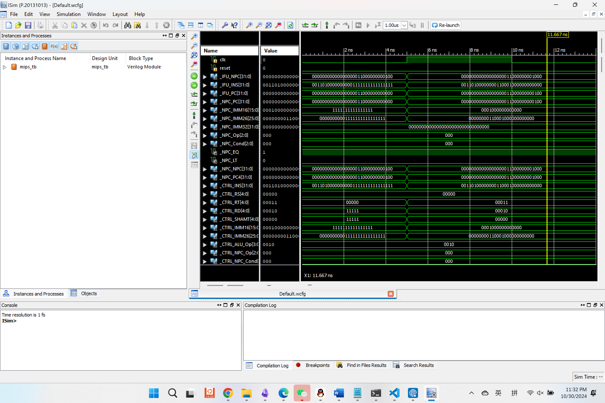

众所周知，在使用ISE进行开发的时候，您可能会遇到以下问题：

- 每次开干，都要手动创建一个新项目
- 创建文件的操作极为繁琐
- 仿真一次需要多次操作鼠标
- ISE项目文件内文件繁多，文件管理堪称灾难

但在本文的方法下，以上问题均可一一化解！

本文是教程中[ISE、VCS 与自动化测试](http://cscore.buaa.edu.cn/tutorial/verilog/verilog-6/verilog-6-6/)的一小点拓展。


# 摆脱ISE的项目文件夹

在教程中，我们发现：在通过命令行使用ISE时，我们实际需要的只有`.prj, .tcl, （模块名）.v`这些文件；

**也就是说，我们完全可以在ISE项目文件夹外新开一个文件夹，存储我们的源代码，并利用命令行调用ISE！**

观察`.prj`的内部结构，发现它其实是支持相对路径的：

```
verilog work "./src/NPC.v"
verilog work "./src/IFU.v"
verilog work "./src/GRF.v"
verilog work "./src/EXT.v"
verilog work "./src/DM.v"
verilog work "./src/CTRL.v"
verilog work "./src/CMP.v"
verilog work "./src/ALU.v"
verilog work "./src/mips.v"
verilog work "./src/mips_tb.v"
```

> 注意！在ISE自动生成的`.prj`中，是没有将testbench包含在内的；若想使用本文中方法进行开发，请务必如上文所示，将testbench顺路包含在`.prj`文件内！

于是，我们就可以把所有的`.v`源代码统一放进工作目录下的一个文件夹内进行管理。

在工作目录下，我们必须放好`.prj, .tcl`文件，以及读入`IFU`的机器码`code.txt`。 最后结构如下所示。


这样就实现了项目目录的有效管理，开新模块的时候也不会有烦人的对话框了。

这也为我们纯使用VSCode+插件等外部编辑器方案提供了极大的便利。

## 241103更新：自动生成`.prj`

自己手动敲`prj`还是难受，还是自动生成吧！

要做到这点也很简单，利用`cmd`的`dir`指令和`for`指令，在进行编译前生成一下`mips.prj`即可：

```cmd
for /f %%i in ('dir /b src') do echo verilog work "./src/%%i" >> mips.prj 
```

实验证明，包含`include`的宏定义文件包含进去不会出问题，使用了这一写法的各位大可不用顾虑。

但需要注意的是，请确保执行之前，目录之内没有已存在的`mips.prj`文件。

# 小事：利用设置好的环境变量

> 此处主要针对Windows用户，相信用Linux看这部分的仙人都知道在Linux上怎么做

在教程内，我们已经知道了自动化运行的指令了；但是，前面跟一大串目录，不觉得很烦人吗？

恰巧，教程里已经提示过你，要将ISE的安装目录加入环境变量了。我们在这部分不妨再说说，怎么利用设置好的环境变量，简化掉指令前面那一大串难看的安装目录。

在正式开始前，我们不妨先Win+R一下，输入`%windir%`，发现他会自动跳转到你的Windows系统目录内。**这说明，Windows（至少cmd）是支持由环境变量名进行目录跳转的**！

要做的事情也很简单了；添加一个值为`（ISE安装目录，如C:\Xilinx\14.7\ISE_DS\ISE）`，名为`xilinx`的环境变量（系统还是用户环境变量均可，实验下来这里都可以）。

然后，我们就可以把命令改写为`%xilinx%\bin\nt64\fuse.exe -nodebug -prj mips.prj -o mips.exe mips_tb`，更加美观。

# 使用命令行生成波形

教程这部分有所欠缺，实际上是可以通过命令行看波形的。

## 小事：有关`.tcl`

正式开始之前，我们先多说一点`.tcl`相关的事。

**教程内提到的`.tcl`，其实就是给ISE的ISim用的一个脚本;编译出来的`mips.exe`其实就是ISim的一个实例。**

我们不加入任何参数执行`mips.exe`，会进入iSim的命令行模式：


`.tcl`里写入的指令，其实就是在这个命令行程序下执行的！

此时我们自然一头雾水，遂输入`help`查看帮助：


猛然发现，有一条`wave`指令，可能跟我们生成波形的需求有关！

查询后得知，`wave log`指令最有帮助，帮助文档说明如下：


回顾我们编译时执行的指令：`%xilinx%\bin\nt64\fuse.exe -nodebug -prj mips.prj -o mips.exe mips_tb`，此时我们实际上是把`mips_tb`当作了顶层模块。

值得注意的是，此时的`object_name`**是对于模块内（即此时的`mips_tb`）的实例的**。

众所周知，ISE自动生成的testbench，待测模块实例默认为`uut`，故我们将其作为`object_name`传入，同时带上`-r`参数递归包含所有子模块，我们就可以在波形文件中得到所有子模块的端口，`wire`等信号的波形。

最后，经修改后的`.tcl`如下：
```
wave log -r uut 
run 200us;
exit
```

在执行了`mips.exe -nolog -tclbatch mips.tcl`后，我们会发现工作目录里多了一个`isim.wdb`文件，这就是我们仿真所得到的波形。

# 查看波形

一番搜索后，使用这一命令即可查看生成的波形：

```
%xilinx%\bin\nt64\isimgui.exe -view isim.wdb
```

通过上述操作，我们的确得到了满意的效果：


此时，你大可将当前视图内的信号全选，全部删除，然后再在UI左侧的`Instances and Processes`与`Objects`里，选择自己感兴趣的信号加入视图。**此时删掉再加信号，并不需要重新仿真才能得到波形，即加即有！！**

> 你问为什么GUI里不是即加即有？因为我们执行的`wave log -r uut `实际上记录了所有的信号，而在GUI里，若你不将要观察的特定信号加入视图，iSim是不会记录这个信号的波形的。

> 事实上，不加`wave log -r uut`也会生成波形文件，不过里面没有记录任何波形

# 编写一键仿真脚本

> 小白向，各路仙人可以直接跳过

要做的事情很简单，写个批处理文件就行了。

```
%xilinx%\bin\nt64\fuse.exe -nodebug -prj mips.prj -o mips.exe mips_tb
mips.exe -nolog -tclbatch mips.tcl
%xilinx%\bin\nt64\isimgui.exe -view isim.wdb
```

将我们要执行的这三条指令写入一个.bat文件，双击即可执行，一键完成`编译-仿真-查看波形`三个步骤。

对于`$display`输出的文本，此时将在弹出的命令行窗口内显示。

## ~~241103更新：更完善的自动化脚本`run.bat`~~

**！！请注意，此处除`clear.bat`外的实现可能存在问题，请看下文241130的更新版本！！**

> 241110：针对P5以后的输出格式，进行了输出过滤正则表达式的完善，再次感谢姜宇墨同学的提醒

主要进行了以下完善：

- 考虑到波形查看并不必要，故`run.bat`默认不打开波形视图，另给出一打开波形试图的`run_waveform.bat`
- 自动生成`mips.prj`
- 添加了编译错误的判断（感谢[罗浩宇同学的帖子](http://cscore.buaa.edu.cn/#/discussion_area/1474/1732/posts)给出的脚本编写思路）
- 在运行后自动进行缓存文件的清理。为此，引入了另一脚本`clear.bat`
- 对输出进行了简单的过滤
- 在命令行内直接查看输出

`run.bat`:
```cmd
@echo off
for /f %%i in ('dir /b src') do echo verilog work "./src/%%i" >> mips.prj 
%xilinx%\bin\nt64\fuse.exe -nodebug -prj mips.prj -o mips.exe mips_tb >nul
IF ERRORLEVEL 1 (
    echo An error occurred when compiling.
    pause
    .\clear.bat
    exit
)
mips.exe -nolog -tclbatch mips.tcl > isim_out.temp
findstr "@" isim_out.temp > isim_out.txt
type isim_out.txt
pause
.\clear.bat
```

`run_waveform.bat`:
```cmd
@echo off
for /f %%i in ('dir /b src') do echo verilog work "./src/%%i" >> mips.prj 
%xilinx%\bin\nt64\fuse.exe -nodebug -prj mips.prj -o mips.exe mips_tb >nul
IF ERRORLEVEL 1 (
    echo An error occurred when compiling.
    pause
    .\clear.bat
    exit
)
mips.exe -nolog -tclbatch mips.tcl > isim_out.temp
findstr "@" isim_out.temp > isim_out.txt
type isim_out.txt
pause
%xilinx%\bin\nt64\isimgui.exe -view isim.wdb
.\clear.bat
```

`clear.bat`
```cmd
@echo off
rmdir isim /s /q
del mips.exe fuseRelaunch.cmd fuse.* isim.wdb isim_out.temp mips.prj
```

注意，在`run.bat`意外中断时，若缓存文件未成功清理，请手动点击`clear.bat`进行清理，以免后续再次仿真时出现问题。

## 241105更新：上机实践经验

在上机过程中，孩子对这一方法进行了实验，确定了上机时这一方案的可用性。不过，注意到有同学反馈上机时使用存在问题。一番总结发现，在使用的时候，需要注意以下几点：

- **目录中不能出现中文字符或特殊符号**，cmd对其支持可谓极差，出现了会导致找不到当前目录下生成的`mips.exe`的问题
- 上机的时候，请先提前手动配置好环境变量。ISE的安装目录，可通过对桌面快捷方式右键-打开文件所在的位置找到。

  **需要注意的是，快捷方式指向的目录并不是我们最终要找的ISE安装目录。我们要找的安装目录，是快捷方式指向的文件夹内，那个叫ISE的文件夹。**

  上机环境的环境变量，请使用`桌面“此电脑”快捷方式-右键菜单，属性-“设置”页中的“高级系统设置”选项-“高级”选项卡中的“环境变量...”`进行编辑。

- **运行目录请务必放在D盘，切勿放在C盘。** 因为上机环境的C盘有读写权限限制，在C盘运行脚本会导致`mips.exe`无法生成，导致运行失败；
- 运行时可能会弹出烦人的SmartScreen弹窗。~~由于这部分我手上没有Win10环境进行测试，这里可能需要各位自行搜索关闭SmartScreen的方法~~ // 上机环境下，由于权限设置，SmartScreen无法关闭。要规避这个问题，建议在打包脚本的时候，先以.txt的格式保存脚本内容，再在上机时，将.txt中脚本，粘贴到**用机房电脑创建的.bat文件里**。你问怎么写？新建.txt，粘贴内容，改扩展名就行了

# 241110更新

> 感谢姜宇墨同学的提醒...

在P5开始，输出格式发生了变化，每一行以当前运行的时间数为开头，本文先前使用的正则表达式匹配方法存在问题，现已修正。

# 241118:两次上机实验发现的问题

这部分我实在没有头绪，希望各位能给出一些完善的思路。

在本人两次于三号机房肝P5时，我没有一次成功查看波形，但是输出正常。查看未过滤的mips.exe输出，发现在执行波形输出时，出现了FATAL ERROR；

但此前在4号实验室时考P4时，波形输出并没有问题。

初步怀疑是cmd并行执行指令引起的问题；如各位有解决这一问题的办法，欢迎私发本人/在评论区提出，万分感谢！

# 241130：上机遇到问题的临时解法

## .bat导致SmartScreen拦截
在上交文件前，把拓展名.bat改成.txt；此后，要么直接把拓展名改回来，要么将.txt中内容，复制到另一份用机房电脑创建的.bat文件中。我个人倾向后者，因为理论而言后者能最稳妥地绕开SmartScreen。

## 并发执行，导致波形无法查看

利用`call`使得各指令顺序执行，尝试避免并行执行引起的问题。**注意，这一改法尚未上机实验，请不要把其作为上机时使用的唯一方法；也欢迎各位上机后反馈使用效果！**

`run.bat`:
```cmd
@echo off
for /f %%i in ('dir /b src') do echo verilog work "./src/%%i" >> mips.prj 
call %xilinx%\bin\nt64\fuse.exe -nodebug -prj mips.prj -o mips.exe mips_tb >nul
IF ERRORLEVEL 1 (
    echo An error occurred when compiling.
    pause
    .\clear.bat
    exit
)
call mips.exe -nolog -tclbatch mips.tcl > isim_out.temp
call findstr "@" isim_out.temp > isim_out.txt
call type isim_out.txt
call pause
call .\clear.bat
```

`run_waveform.bat`:
```cmd
@echo off
for /f %%i in ('dir /b src') do echo verilog work "./src/%%i" >> mips.prj 
call %xilinx%\bin\nt64\fuse.exe -nodebug -prj mips.prj -o mips.exe mips_tb >nul
IF ERRORLEVEL 1 (
    echo An error occurred when compiling.
    pause
    .\clear.bat
    exit
)
call mips.exe -nolog -tclbatch mips.tcl > isim_out.temp
call findstr "@" isim_out.temp > isim_out.txt
call type isim_out.txt
call pause
call %xilinx%\bin\nt64\isimgui.exe -view isim.wdb
call .\clear.bat
```

`clear.bat`不用修改，按上面的实现就可以了。

# 241209：确认问题解决

在两次试验241130中的修改后，波形已确保可以稳定生成。本方法自此可确认可靠。

在上机使用时，仍需注意SmartScreen引起的问题，解法见上文。

# TL;DR：上机怎么用？

这里针对直接使用Windows环境，Linux仙人可能需要自己钻研一下（当然用Linux的一般也不用看这个教程吧，笑）...

## 课下准备
把脚本改成`.txt`后缀，再塞进自己的提交里

## 课上：**配置名为`xilinx`的环境变量**

> 为适应不同ISE安装目录而开发。若觉得配置环境变量太麻烦，建议直接把脚本里的`%xilinx%`直接换成ISE的安装目录，因为ISE的默认安装目录应该都是一样的。

`此电脑-属性-高级系统设置-环境变量-（新建用户环境变量）`


其中，ISE的目录在上机时应该也是`C:\Xilinx\14.7\ISE_DS\ISE`；

最保险的方法是，`对着ISE的桌面快捷方式右键-打开文件位置-打开弹出的"ISE_DS"文件夹内的"ISE"文件夹-复制路径` 。

**注意！ISE快捷方式直接打开的文件夹不是我们要的目标！！要多点进一个文件夹，不要忘了！**

## 课上：用机房电脑创建脚本

**机房电脑由于权限设置，不可能关掉SmartScreen。** 为了绕开这个当前场景无用的安全检查，我们只能这么绕一下。

这里主要针对要双击运行的`run.bat`。`clear.bat`由于在`run.bat`内间接调用，这个安全机制无效，可以不用处理。

- 用机房电脑，创建跟你的脚本同名的`.bat`（创.txt再改后缀，这里不赘述了）。
- 等到开始考试时，把你的脚本.txt内容拷贝进刚刚创建的.bat。
- 把准备好的.bat放进你的源码文件夹（结构见上文），即可绕开SmartScreen，双击即可直接运行。
 
本文就到此结束了，速速实践，摆脱ISE臃肿的GUI吧！🤤
