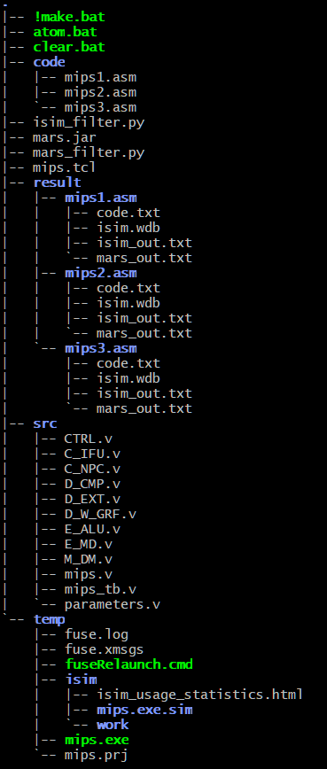
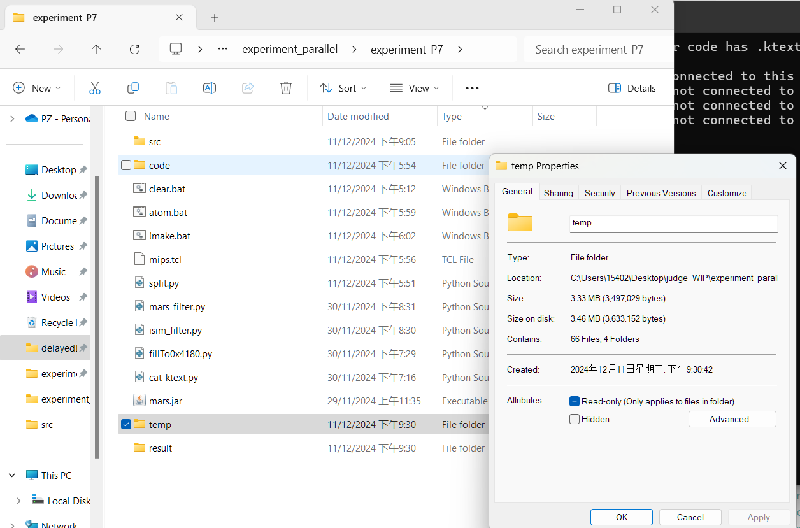

> 是不是发晚了一点？

读前须知：本文针对Windows环境；Linux仙人参考思路即可...

# 需求：针对多组测试数据的评测

为尽可能追求测试覆盖率，且方便测试程序的编写，我们往往会选择构造多组测试数据进行测试。

回顾本人先前构造，且至今一直使用的对拍脚本，每次仅可对拍一组测试数据。要进行多组数据的测试，需要每次对待测数据进行手动替换，效率实在太低。

因此，我决定对我的对拍脚本进行完善，使之支持多组数据的评测。

# 已有评测机存在的问题 - 效率太低

考察了当前已有的`COKiller`等支持多数据评测的评测机，发现存在以下问题：
- 对多组测试数据的测试均是**串行进行**
- 有重复编译的现象产生

上述两个问题会大幅降低评测效率。

我们都知道，我们的Verilog代码是由fuse编译成iSim实例来运行的；对于一次对拍，我们只需要编译一次。

串行评测多组数据就不用说了，效率低自是当然。

# 本方法的实现

## 整体结构

以支持延迟槽对拍的脚本为例。P7的除了多加几个.py处理.ktext外，没啥区别...



- `!make.bat`：对拍程序入口；
- `atom.bat`：对一个测试数据进行对拍；
- `clear.bat`：清理临时文件；
- `/code`：存放各组测试数据
- `/src`：存放Verilog源码
- `/temp`：临时存放编译结果
- `result`：存储各数据的对拍结果：输出与波形
- `*_filter.py`：过滤输出，避免输出出现版权信息/向`$0`写入的信息
- `mips.tcl`：配置是否产生波形/仿真上限时间用；具体见教程自动化测试相关内容
- `mars.jar`：**带输出的MARS**。需要注意的是，各版本MARS运行时需要的参数可能不同，需要手动进入`atom.bat`进行修改；这个当然可以通过造接口解决，我图省事没做...

## `!make.bat`

完成Verilog代码的编译工作，同时开始调度，让`atom.bat`对每组数据进行处理。

```c
@echo off

%运行前，先清一遍临时文件，以防没清干净%
	rmdir /s /q result 2> nul
	rmdir /s /q temp 2> nul

%开始编译%

	md temp
	cd temp

	%根据src下源码，自动生成.prj文件%
	for /f %%i in ('dir /b ..\src') do echo verilog work "..\src\%%i" >> mips.prj 
	
	%xilinx%\bin\nt64\fuse.exe -nodebug -prj mips.prj -o mips.exe mips_tb >nul
	IF ERRORLEVEL 1 (
	    echo An error occurred when compiling.
	    pause
	    exit
	)

%编译结束，退回上级目录%
	cd ..

%创建result文件夹，方便组织输出% 
	md result
	cd result

%开始调度：以result为工作目录，对每个测试数据调用atom.bat进行处理%
	for /f %%i in ('dir /b ..\code') do ( 
	
	start ..\atom.bat %%i
	
	)
%处理完成，退回上级目录%
	cd ..


%输出提示：只有在所有测试都完成，即上面start指令弹出的窗口都关闭时，才可按键继续，开始比较；否则会出现找不到文件的情况%

	echo Please continue only when EVERY TEST IS DONE.
	pause

%进行对拍比较%

	echo Performing comparison...
	
	cd result
	
	for /f %%i in ('dir /b ..\code') do ( 
	
	echo %%i
	
	cd %%i
	fc /3 isim_out.txt mars_out.txt
	cd..
	
	)

%比较结束，退回上级目录，方便后面clear.bat执行%	
	cd ..

%暂停，方便查看输出%
	pause

%结束时，清除一下编译产生的临时文件%
	clear.bat
```


## `atom.bat`

每组数据的实际处理程序。

由于iSim的运行限制，为了实现并发执行，**我们不得不把编译好的程序，复制到每个测试数据的输出目录下，在得到输出后再将其删除。这显然会带来存储空间带来压力，但真的没有更好的办法了。**

我对P7的编译结果进行了查看，总大小是3mb左右；正常测试点数量规模下，占用还是能控制到1gb以下的；况且我们最后还是要给它删掉的嘛...



```c
@echo off

%提示在处理哪组数据%
	echo %1
%在result目录下建立各组数据的输出文件夹%
	md %1
	cd %1
%获取机器码和mars输出%
	java -jar ..\..\mars.jar db mc CompactDataAtZero a dump .text HexText code.txt ..\..\code\%1 > nul
	java -jar ..\..\mars.jar db mc CompactDataAtZero nc ig coL1 ..\..\code\%1  > mars_out.temp

%复制编译结果%
	md temp
	call xcopy /s /e /y ..\..\temp\ .\temp > nul

%获取行为仿真结果%
	cd temp
	copy ..\code.txt code.txt > nul
	call mips.exe -nolog -tclbatch ..\..\..\mips.tcl > ..\isim_out.temp
	%获取波形（如果有必要...）%
	copy isim.wdb ..\isim.wdb > nul
%完事，退回上一级%
	cd ..
	
%过滤输出%
	python ..\..\isim_filter.py > nul
	python ..\..\mars_filter.py > nul
	
%删除输出临时文件%
	del *.temp
	
%删除复制的编译结果%
	rmdir /s /q temp

%完成，退回result%
	cd ..
exit
```


## `clear.bat`

只用清掉最开始的编译结果就行了。结果在下次执行时自动删除。

```c
@echo off
rmdir /s /q temp
```


其余的就不必说明了。

# 本方法未完善之处

## 不大好解决的

- **在数据组数较大的情况下，生成的临时文件总大小过大。** 这个在上面已经说过了，*欢迎有解决办法的朋友积极指出，在此本人感激不尽！*

- **start一次，开一个窗口。** 这好像也可以算特性了？

  我对这个结果不大满意。在我的设想里，并行调用`atom.bat`时**应该没有任何反应**。在所有并发任务都结束之后，再自动进入比较环节。**在座的各位一定有更好的办法。**

- **调度策略过于鲁莽。** 在本实现中，我们运用批处理的`start`来实现并行；读了上面的实现，我们不难发现，我们此时**有多少个测试点，就会同时开多少个`atom.bat`；若测试规模足够大，恐怕没有电脑能吃得消（看下面的分析，甚至8个就够呛）...

  我的优化想法，是在`make.bat`里调用`atom.bat`的时候，不直接用`start`+循环调用，而是**调用一个任务分配程序**，由它按照配置好的最大并行数，进行数据测试任务的分配。*再次，欢迎有解决办法的朋友积极指出，在此本人感激不尽！*

  同时，由于我对Windows的批处理并行稍微熟悉，这部分我选择用.bat来写；**相信`python`等在并行方面有更好的办法。**

## 性能分析

这里，我选择同时测试3组P7的测试点来进行性能分析。

我的电脑配置如下：


在CPU占用上，**每一个**`mips.exe`的CPU占用**就已在10~20%左右波动**；这也是为什么我上面说，现在的调度策略行不通：
  

内存占用其实还好，算上命令行和mips.exe的，总体还在可接受范围：


# 好解决的

- **必须人为判断各测试是否已完成（即start调用的窗口是否已经全部关闭）后，才能进行比较。** 各路仙人的评测机已经有不少解决方案了。
- **比较方法较为原始。** 这个可以用python的difflib等解决，不赘述了。


# 演示下载

技术演示 - https://bhpan.buaa.edu.cn/link/AA86CF06932380478FBD0AB8D9A22178D8
文件名：experiment_parallel.zip
有效期限：永久有效
提取码：9eXL

**！！在运行前，请先配置好xilinx用户环境变量，具体见：http://cscore.buaa.edu.cn/#/discussion_area/1461/1777/posts ！！**

点击`!make.bat`运行，运行前先在`/src`里放好Verilog源码，在`/code`里放好待对拍`.asm`。

